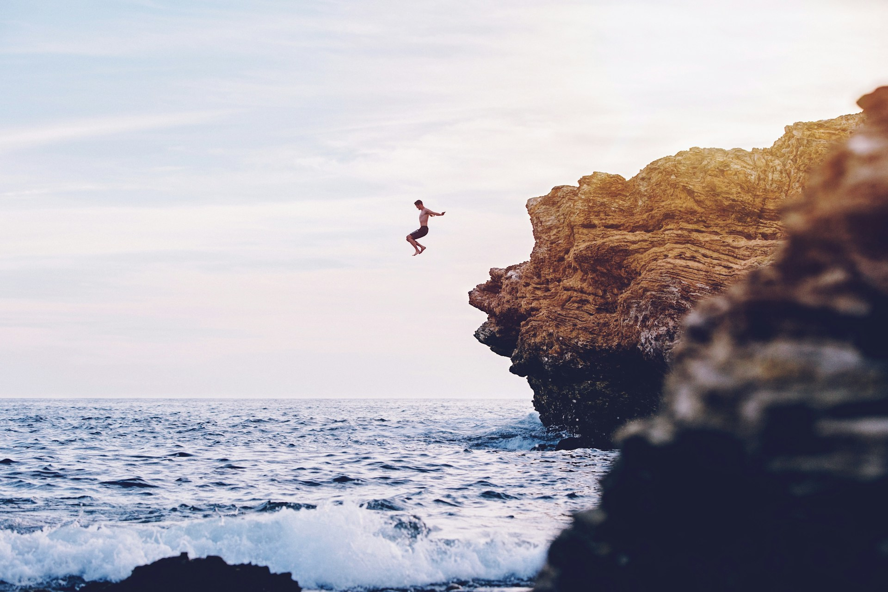

It has taken me a while to figure out if I should start The Civia Project. I have always understood the why behind it, but I was not sure if I should take the plunge.

Out of fear, uncertainty, comfort and a good dose of imposter syndrome. Now I know that I must. Fear still lingers and I do still feel as an imposter, but I have decided to act despite them and I hope that with time they will fade away.

As to why, there are a couple of reasons as to why I have decided to start The Civia Project.

1. To leave a better world for my children.
2. To do something that matters.
3. To inspire others to take action.

## Better World

My paternal grandparents were born as war ended but famine, disease and devastation continued. Countries were rebuilding themselves in the aftermath World War I. Some alliances changed, others stayed the same.

When my maternal grandparents were born the world was in flames again. The 2nd time in the 20th century &mdash; World War II. People were fighting, dying, being exterminated, and yet in the ashes of what seemed like the end of everything, **a better world** emerged. Not perfect, not good, but better. Some alliances changed, others staying the same.

My parents were born into that better world. Europe was rebuilding itself again, and so was the rest of the world. Now we had a divided Europe, the Iron Curtain, the Cold War. But still, a better world.

During my parents early years &mdash; Europe had two opposing blocks that evolved differently. The Western world embraced democracy and capitalism, while the Eastern bloc was forced to adopt communism and a planned economy. Still, **a better world**.

When I was born, the Berlin Wall was still standing, but the winds of change were already blowing. The Eastern bloc was crumbling, and with it, the Iron Curtain fell. Europe was free to move, trade and cooperate. The European Union, NATO, the Schengen Area were on our horizon. In time, they were at our doorstep. **A better world**.

My daughter was born just before we joined the Schengen Area. And I hope that she will never know borders in Europe, that she will be able to travel, study, work and live wherever she wants in Europe.

Even post World War II, there were and are still wars, conflicts, famine and devastation around the world. But I believe that we are living in **a better world** than our grandparents and parents did. And I want to do my part to ensure that my children and grandchildren will live in an even better world.

### Threats to a Better World

Until recently, I did not know what to do to contribute to that better world. But now I do. Due to the recent turmoil in the 2024-2025 Romanian Presidential Elections, I have decided to take action.

Election interference, propaganda, misinformation, manipulation, deception, fake news, bots, trolls, deepfakes. These are not just words anymore. Nor are they happening to others. They are real threats to our democracy, our freedom and our future and they are happening here, in my country, in Europe, and in the world &mdash; _right now_.

## Something That Matters

I have always known how a social media bot works. Impersonation, fake accounts, automated posting, liking, sharing, commenting. Looking human, but not being human. A tool used to scam, bully, manipulate, deceive and spread misinformation.

Now with LLMs and generative AI, the game has changed. The barrier to entry is lower than ever. Anyone can create convincing fake profiles, generate human-like text, images, audio and video. The potential for misuse is enormous.

Social Media was supposed to connect us, but instead it has divided us. It has created echo chambers, spread misinformation, and eroded trust in institutions. It has been weaponized by bad actors to manipulate public opinion and sow discord. Not anymore.

I want to use my knowledge and skills to create something that matters. Something that can help restore trust, promote truth, and foster understanding. The Civia Project is my way of contributing to a better world.

This project is not just about technology, it is about values. It is about standing up for what is right, even when it is difficult. It is about using technology for good, not for harm or for profit. It is about making a difference, one step at a time.

## Inspire Others

Courage over comfort. Fight fear with action and by knowing that this is the right thing to do. Ignorance may be bliss, but knowing that you stood by and did nothing is a heavy burden to bear.

Change starts with one person. One idea. One action. I hope that by sharing my journey, I can inspire others to take action as well.

## Help Needed

I await you to join me on this adventure in whatever capacity you can. Together, we can make a difference. Together, we can create a better world.

No pressure, no expectations, just an open invitation to be part of something that I hope will be meaningful and will bring positive change to the world. If you feel called to contribute, reach out. Every skill, every voice, every effort counts.

If you feel called to contribute, reach out. Every skill, every voice, every effort counts.
